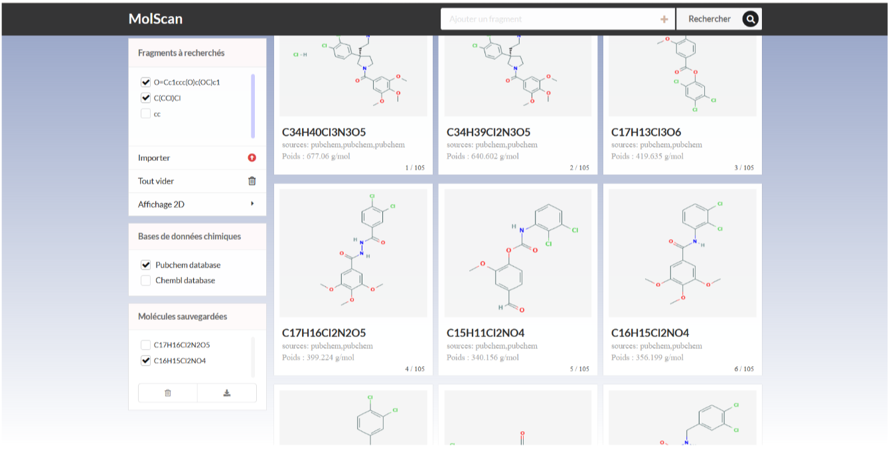

# molscan
Moteur de recherche de molécules chimiques permettant, à partird’une combinaison de fragments moléculaires, de trouver l’ensemble des molécules contenant tous ces derniers en interrogeant les bases de données chimique Pubchem et Chembl. Son importance est de donner à l’utilisateur des possibilités de recherche plus précise enfonction de ses besoins expérimentaux ou de production.

## Capture

## langages et outils utilisés
- html, css, js
- vuejs, vue-cli, vuex
- nodejs
- sqlite
- semantic ui
## Auteur
Abdou Abdoul-Hafarou
